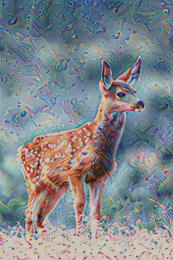

# Style GAN - Neural Style Transfer API

A production-ready style transfer service with a FastAPI backend, GPU inference, and a simple workflow for demos.

## Demo Gallery (from tests/test_images)

Subject image:


Style references:


Sample outputs:




## Features

- GPU-accelerated inference (PyTorch)
- FastAPI service with async job flow
- Redis-backed job tracking
- S3-compatible storage (MinIO or AWS S3)
- Docker-first deployment

## Architecture

- API: `src/api/main.py`
- Models: `src/models/`
- Image pipeline: `src/preprocessing/` and `src/postprocessing/`
- Jobs and storage: `src/services/`

## Quick Start (Docker, recommended for demos)

Prereqs:
- Docker
- Docker Compose
- NVIDIA Container Toolkit (for GPU inference)

```bash
# Build and start core services
docker compose up -d --build redis minio
docker compose up -d --build style-transfer-api

# Optional: monitoring stack
docker compose up -d --build prometheus grafana
```

API will be available at `http://localhost:8080`.

## API Usage

Health check:

```bash
curl http://localhost:8080/health
```

Submit a job:

```bash
curl -X POST http://localhost:8080/v1/generate \
  -H "Authorization: Bearer YOUR_TOKEN" \
  -H "Content-Type: application/json" \
  -d '{
    "subject_image_uri": "s3://bucket/subject.jpg",
    "style_image_uri": "s3://bucket/style.jpg",
    "preset": "balanced",
    "resolution": [1024, 1024]
  }'
```

Check job status:

```bash
curl -H "Authorization: Bearer YOUR_TOKEN" \
  http://localhost:8080/v1/jobs/<job_id>
```

## Local Demo with Test Images

The `tests/test_images` folder includes sample inputs and outputs used in docs and tests.

```bash
# Quick smoke test
python tests/test_api.py
```

## Project Structure

```
Style_GAN/
  src/                    # Application code
  tests/                  # Tests and sample images
  config/                 # Service configs
  deployment/             # Docker entrypoints and health checks
  docker-compose.yml      # Local demo stack
  Dockerfile              # GPU-enabled build
  requirements.txt        # Python dependencies
```

## Notes

- For real GPU inference, run the Docker stack on a machine with an NVIDIA GPU.
- If you want a hosted demo, deploy the Docker image on a GPU-capable provider.
